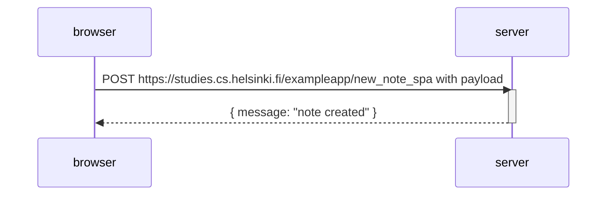

```mermaid
sequenceDiagram
participant browser
participant server

    browser->>server: POST https://studies.cs.helsinki.fi/exampleapp/new_note_spa with payload
    activate server
    server-->>browser: { message: "note created" }
    deactivate server

```

The new Note that was saved appears on the page.
